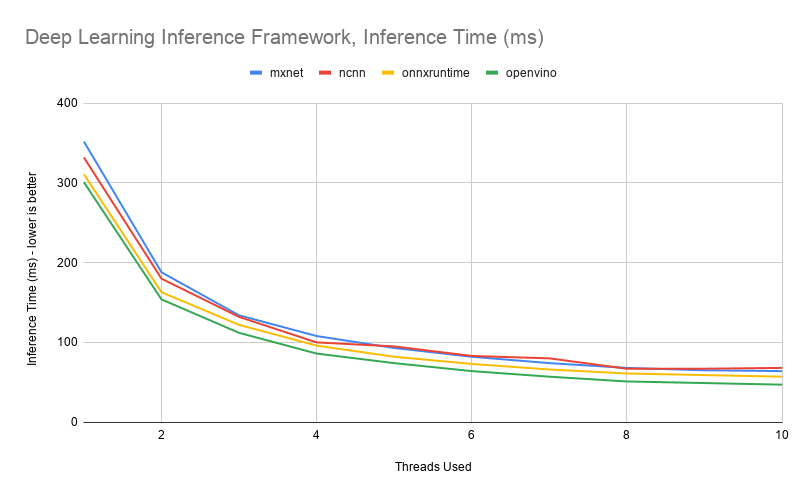
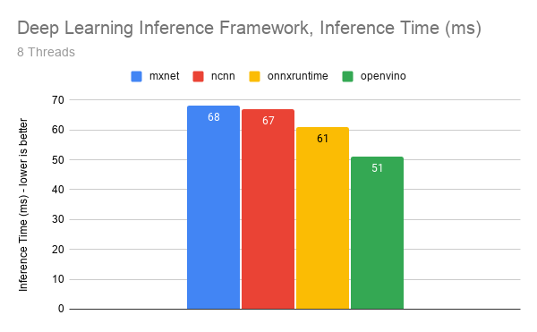
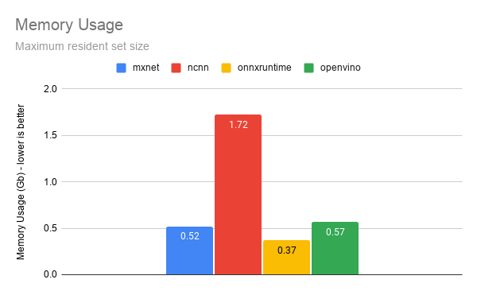
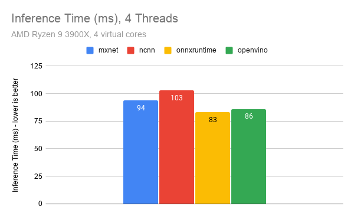
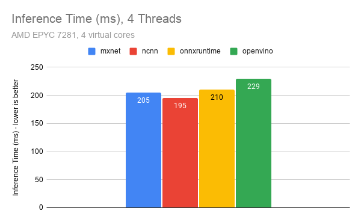

# Deep Learning Inference Framework Speed Benchmarks - CPU

## About 
This project benchmarks the performance of various popular deep learning inference frameworks on x86_64 CPU.
The intention is to determine which has the lowest latency, and how the number of threads used for inference impacts performance.
Thead dependency can be used to optimize CPU throughput (ex. run multiple instances in parallel each only using a reduced number of threads).

## Test Specs
The benchmarks are performed on `Dual Intel(R) Xeon(R) CPU E5-2630 v4 @ 2.20GHz`, 20 cores total, 128 Gb of ram.
The model used for inference is the [Arcface](https://docs.openvinotoolkit.org/latest/omz_models_public_face_recognition_resnet100_arcface_face_recognition_resnet100_arcface.html) ResNet100 with 65.131 MParams and 24.209 GFLOPs. 
The model was trained in mxnet.
The model input is a 112x112 rgb image. 
The time taken to read the image into memory and decode the image to rgb format is *not* included in the inference time.
The time taken to convert the rgb image buffer into the framework-specific expected network input format *is* included in the inference time. 
First inference time is discarded to ensure all network weights and params have been loaded. Memory usage refers to maximum resident set size.
The number of inferences used to generate the average time is on the order of 1000. 
*Unrestricted threads* in tables below means allowing the inference framework to choose how many threads it wants to use on it's own.
Runtime dependencies refers to dependencies which must be linked and are *not* standard system libraries such as `libstdc++.so`. 

## Usage
- Start by navigating to the `3rd_party_libs` directory and compile the inference frameworks by running the provided shell scripts.
- `./deeplearningInferenceBenchmarks /path/to/model/directory number_of_threads (optional)`

## Summary

## Results

### mxnet
- Github [link](https://github.com/apache/incubator-mxnet)
- git release tag: `1.8.0.rc3`
- Using MKL backend, download instructions [here](https://software.intel.com/content/www/us/en/develop/articles/installing-intel-oneapi-toolkits-via-apt.html)
- CMake build arguments: `-DUSE_CPP_PACKAGE=1 -DBUILD_CPP_EXAMPLES=OFF -DUSE_CUDA=0 -DUSE_MKL_IF_AVAILABLE=1 -DUSE_BLAS=mkl -DUSE_OPENCV=0 -DUSE_LAPACK=0 -DUSE_OPENMP=1 -DMKL_INCLUDE_DIR=/opt/intel/oneapi/mkl/latest/include -DMKL_RT_LIBRARY=/opt/intel/oneapi/mkl/latest/lib/intel64/libmkl_rt.so -DCMAKE_BUILD_TYPE=Release`
- Runtime dependencies: `libmkl_rt.so libomp.so libpthread.so`
- Maintains output integrity: yes

| Number of threads     | Average inference speed   | Memory usage  |
|-------------------    |-------------------------  |-------------- |
| 1                     | 352 ms                    | 0.52 Gb       |
| 2                     | 188 ms                    | 0.52 Gb       |
| 3                     | 134 ms                    | 0.52 Gb       |
| 4                     | 108 ms                    | 0.53 Gb       |
| 5                     | 93 ms                     | 0.52 Gb       |
| 6                     | 82 ms                     | 0.52 Gb       |
| 7                     | 74 ms                     | 0.52 Gb       |
| 8                     | 68 ms                     | 0.52 Gb       |
| 9                     | 65 ms                     | 0.52 Gb       |
| 10                    | 64 ms                     | 0.52 Gb       |
| Unrestricted (10)     | 67 ms                     | 0.52 Gb       |

### ncnn
- Github [link](https://github.com/Tencent/ncnn)
- git release hash: `5e4ea0b`
- CMake build arguments: `-D NCNN_BUILD_EXAMPLES=OFF -D NCNN_VULKAN=OFF -D NCNN_AVX2=ON -D CMAKE_BUILD_TYPE=Release`
- Runtime dependencies: `libomp.so`
- Maintains output integrity: yes

| Number of threads 	| Average inference speed 	| Memory usage 	|
|-------------------	|-------------------------	|--------------	|
| 1                 	| 332 ms                  	| 1.72 Gb      	|
| 2                 	| 180 ms                  	| 1.72 Gb      	|
| 3                 	| 132 ms                  	| 1.72 Gb      	|
| 4                 	| 100 ms                  	| 1.72 Gb      	|
| 5                 	| 95 ms                   	| 1.72 Gb      	|
| 6                 	| 83 ms                   	| 1.72 Gb      	|
| 7                 	| 80 ms                   	| 1.72 Gb      	|
| 8                 	| 67 ms                   	| 1.72 Gb      	|
| 9                 	| 67 ms                   	| 1.72 Gb      	|
| 10                	| 68 ms                   	| 1.72 Gb      	|
| Unrestricted (20) 	| 66 ms                   	| 1.72 Gb      	|

### OpenVINO
- Github [link](https://github.com/openvinotoolkit/openvino)
- git release tag: `tags/2021.2`
- Using MKL-DNN CPU plugin.
- Model optimization run with following options: `python3 mo_mxnet.py --input_model ./mxnet-0000.params --input_shape [1,3,112,112] -reverse_input_channels`
- CMake build arguments: `-DCMAKE_BUILD_TYPE=Release`
- Runtime dependencies: `libinference_engine.so libngraph.so libinference_engine_transformations.so libtbb.so.2 libpthread.so.0 libMKLDNNPlugin.so`
- Maintains output integrity: no, output is slightly different due to model optimization.

| Number of threads     | Average inference speed   | Memory usage  |
|-------------------    |-------------------------  |-------------- |
| 1                     | 301 ms                    | 0.57 Gb       |
| 2                     | 154 ms                    | 0.57 Gb       |
| 3                     | 112 ms                    | 0.57 Gb       |
| 4                     | 86 ms                     | 0.57 Gb       |
| 5                     | 74 ms                     | 0.57 Gb       |
| 6                     | 64 ms                     | 0.57 Gb       |
| 7                     | 57 ms                     | 0.57 Gb       |
| 8                     | 51 ms                     | 0.57 Gb       |
| 9                     | 49 ms                     | 0.57 Gb       |
| 10                    | 47 ms                     | 0.57 Gb       |
| Unrestricted (10)     | 46 ms                     | 0.57 Gb       |

### onnx-runtime 
- Github [link](https://github.com/microsoft/onnxruntime)
- git release hash: `718ca7f` - v1.6.0
- `GraphOptimizationLevel::ORT_ENABLE_ALL` optimization level
- Maintains output integrity: yes
- **Default CPU**
- Runtime dependencies: `libonnxruntime.so.1.6.0 libgomp.so.1`

| Number of threads 	| Average inference speed 	| Memory usage 	|
|-------------------	|-------------------------	|--------------	|
| 1                 	| 311 ms                  	| 0.37 Gb      	|
| 2                 	| 163 ms                  	| 0.37 Gb      	|
| 3                 	| 122 ms                  	| 0.37 Gb      	|
| 4                 	| 96 ms                   	| 0.37 Gb      	|
| 5                 	| 82 ms                   	| 0.37 Gb      	|
| 6                 	| 73 ms                   	| 0.37 Gb      	|
| 7                 	| 66 ms                   	| 0.37 Gb      	|
| 8                 	| 61 ms                   	| 0.37 Gb      	|
| 9                 	| 59 ms                   	| 0.37 Gb      	|
| 10                	| 57 ms                   	| 0.37 Gb      	|
| Unrestricted (20) 	| 63 ms                   	| 0.37 Gb      	|

## AMD Results
Intel is known for throttling their MKL library for AMD CPUs. 
It is therefore important to measure the latency on AMD CPUs, shown below: 

